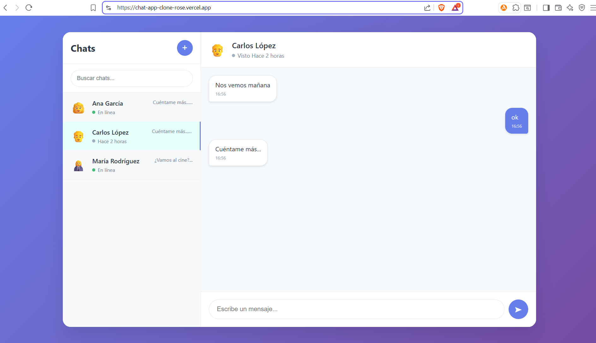

Clon de Aplicación de Chat 

[](https://reactjs.org/)
[](https://developer.mozilla.org/en-US/docs/Web/CSS)

Aplicación de chat desarrollada con React y CSS nativo, implementando funcionalidades principales de mensajería.

Funcionalidades

Principales
- ✅ Lista de chats con estados (online/offline)
- ✅ Ventana de conversación con historial independiente
- ✅ Burbujas de mensajes diferenciadas (derecha/izquierda)
- ✅ Envío de mensajes en tiempo real
- ✅ Respuestas automáticas con delay
- ✅ Creación dinámica de nuevos chats

Bonus
-  Búsqueda de chats en tiempo real
-  Animaciones CSS en mensajes
-  Diseño completamente responsive

Tecnologías

- React 18.2.0 - Hooks (useState, useEffect), Context API
- CSS Nativo - Flexbox/Grid, diseño responsive
- Componentes - Arquitectura modular y reutilizable

- Demo
Aplicación desplegada: https://chat-app-clone-rose.vercel.app

Vista Previa


Instalación

```bash
# Clonar repositorio
git clone https://github.com/tu-usuario/chat-app-clone.git

# Instalar dependencias
npm install

# Ejecutar
npm start

